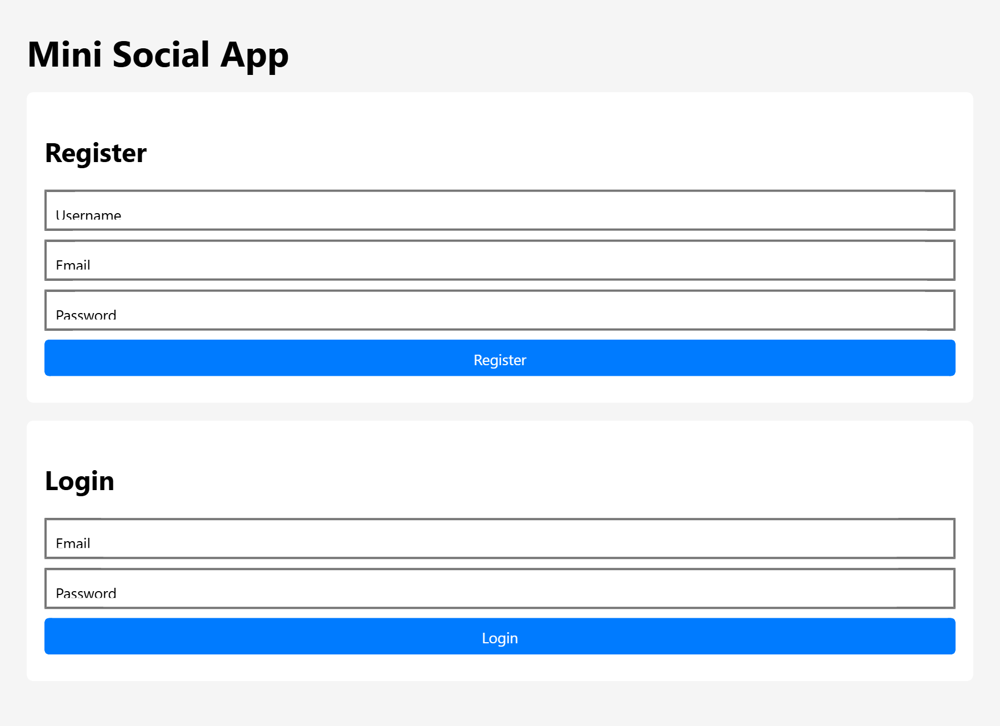

# Mini Social App

A social media API and lightweight client built with Node.js, Express, and MySQL — JWT authentication with refresh tokens, role-based access control, and a layered backend architecture (controller → service → repository) built with dependency injection.




## About

This is a small social platform — register, log in, post, like, and comment — built to demonstrate backend fundamentals rather than to be a product: secure authentication, authorization, request validation, and a codebase organized the way a production Node service would be, not a single `server.js` file with everything crammed in.

## Features

- **Authentication** — registration and login with bcrypt-hashed passwords, short-lived JWT access tokens, and server-persisted refresh tokens for session renewal and revocation.
- **Authorization** — role-based access control (`USER` / `ADMIN`); post edit/delete is restricted to the post's owner or an admin, and `GET /auth/users` is admin-only.
- **Social features** — create posts, like/unlike, comment, and view a chronological feed with like counts.
- **Request validation** — registration, login, post, and comment endpoints validate and sanitize input (email format, password length, required fields) and return field-level error messages instead of opaque 500s.
- **Rate limiting** — stricter limits on auth endpoints to slow down brute-force attempts.
- **XSS-safe rendering** — user-generated content (post titles, content, usernames) is escaped before being inserted into the DOM on the frontend.

## Architecture

```
Client (fetch)
      │
      ▼
Express routes  →  validation middleware  →  auth/role middleware
      │
      ▼
Controllers  →  Services (business rules)  →  Repositories (SQL)
      │
      ▼
   MySQL
```

Dependencies are wired up in a small [DI container](backend/src/di/container.js) rather than each layer constructing its own collaborators, which is what makes the service layer unit-testable without a database (see [Testing](#running-tests)).

## Tech Stack

| Layer | Choices |
|---|---|
| Runtime | Node.js, Express 5 |
| Database | MySQL 8 (`mysql2`) |
| Auth | `bcrypt`, `jsonwebtoken` |
| Validation | `express-validator` |
| Testing | Jest, Supertest |
| Frontend | Vanilla JS (ES modules), no framework |

## API Reference

| Method | Endpoint | Auth | Description |
|--------|-----------|------|-------------|
| `POST` | `/auth/register` | — | Register a new user |
| `POST` | `/auth/login` | — | Authenticate, receive an access + refresh token |
| `POST` | `/auth/refresh` | — | Exchange a refresh token for a new access token |
| `POST` | `/auth/logout` | — | Revoke a refresh token |
| `GET`  | `/auth/users` | ADMIN | List all users |
| `GET`  | `/posts` | — | Get the feed |
| `GET`  | `/posts/:id` | — | Get a post with its comments |
| `POST` | `/posts` | required | Create a post |
| `PUT`  | `/posts/:id` | owner/ADMIN | Update a post |
| `DELETE` | `/posts/:id` | owner/ADMIN | Delete a post |
| `POST` | `/posts/:id/comments` | required | Add a comment |
| `POST` | `/posts/:id/like` | required | Toggle a like |

## Getting Started

### Prerequisites

- Node.js 18+
- A running MySQL 8 server

### 1. Clone and install

```bash
git clone https://github.com/MateiSapunaru/SocialMediaApp.git
cd SocialMediaApp/backend
npm install
```

### 2. Configure environment

Copy the example file and fill in your own values — `.env` is gitignored, so your credentials never get committed:

```bash
cp .env.example .env
```

```env
PORT=3000
DB_HOST=localhost
DB_USER=root
DB_PASSWORD=yourpassword
DB_NAME=socialmedia_app
ACCESS_TOKEN_SECRET=yourSecretKey
ACCESS_TOKEN_EXPIRES=15m
REFRESH_TOKEN_TTL_DAYS=7
```

### 3. Set up the database

```bash
mysql -u root -p < database/schema.sql
```

### 4. Run the backend

```bash
npm run dev
```

### 5. Serve the frontend

```bash
cd ../frontend
npx serve .
```

## Running Tests

The backend has a Jest unit test suite covering the auth/post service logic (registration, login, ownership and admin rules, like toggling) and JWT signing — all run against mocked repositories, so it doesn't need a database:

```bash
cd backend
npm test
```

## Project Structure

```
backend/
├── src/
│   ├── config/          # DB connection and environment variables
│   ├── controllers/     # Route handlers
│   ├── services/        # Business logic (+ unit tests)
│   ├── repositories/    # SQL queries
│   ├── middlewares/     # Auth, roles, rate limiting, validation, errors
│   ├── validators/      # express-validator rule sets (+ tests)
│   ├── routes/          # Express routers
│   ├── di/              # Dependency injection container
│   ├── utils/           # JWT and password helpers (+ tests)
│   ├── app.js
│   └── server.js
├── database/
│   └── schema.sql
└── .env.example

frontend/
├── index.html
├── style.css
└── js/
    ├── api.js           # fetch wrapper + token refresh
    ├── auth.js          # register/login forms
    ├── feed.js          # feed, posting, likes, comments
    └── main.js
```

## Notes on Security

- Passwords are hashed with bcrypt before storage; access tokens are short-lived and refresh tokens are stored server-side so they can be revoked.
- All mutating endpoints validate input server-side; ownership and role checks live in the service layer, not just the route.
- User-generated content is HTML-escaped before rendering — the earlier version of this project had a stored-XSS bug in the feed renderer, since fixed.
- Secrets live in a gitignored `.env`; never in source control.
